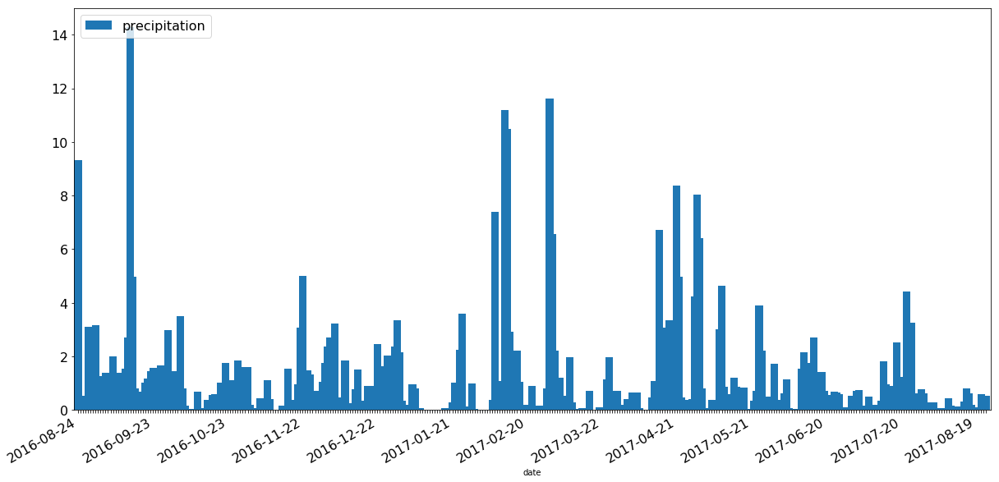
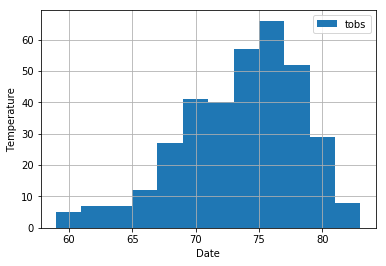
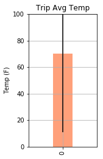

```python
import matplotlib.pyplot as plt
import matplotlib.dates as mdates
import matplotlib.ticker as ticker
import numpy as np
import pandas as pd
import os


from sqlalchemy import *
from sqlalchemy.orm import *

import sqlalchemy
from sqlalchemy.ext.declarative import declarative_base
Base = declarative_base()
from sqlalchemy.ext.automap import automap_base
from warnings import filterwarnings
import pymysql
filterwarnings('ignore', category=pymysql.Warning)
import warnings
warnings.filterwarnings('ignore')

from dateutil.relativedelta import relativedelta
import datetime

from scipy.stats import sem


```


```python
#create new database and connection
engine = create_engine("sqlite:///databases/hawaii.sqlite", echo=False)
session = scoped_session(sessionmaker(bind=engine))

#use reflection to map the classes
Base = automap_base()
Base.prepare(engine, reflect=True)
Base.classes.keys()

#references to the classes
measurements = Base.classes.measurements
stations = Base.classes.stations
```


```python
#get the last entry in the measurements table
sql_query = """
   SELECT *
   FROM measurements
   ORDER BY date DESC
   LIMIT 1
   ;
"""
check = pd.read_sql_query(sql_query, engine)
d = check['date'][0]

```


```python
#get the last date 12 months ago
end_date = datetime.datetime.strptime(d,"%Y-%m-%d")
start_date = end_date + relativedelta(months=-12)
start_date_str = start_date.strftime("%Y-%m-%d") 
start_date_str

```


    '2016-08-23'


```python
#get all precipitation data 12 months ago
selected = session.query(measurements).filter(measurements.date > start_date).all()

#load data to a dataframe
last_12_months_prcp = []
for each in selected:
    last_12_months_prcp.append({"date": each.date, "prcp": each.prcp})

last_12_months_prcp_df = pd.DataFrame(last_12_months_prcp)

```


```python
#plot date, precipitation
new_df = last_12_months_prcp_df.groupby(['date']).sum().fillna(0)
idx = pd.date_range(start_date+relativedelta(days=1),end_date,frequency='M')
new_df.set_index(idx)

prcp_plot = new_df.plot(kind='bar',x=new_df.index,figsize=(20,10),\
                        width=3.0,fontsize=16,title='')

#set the legend
prcp_plot.legend(['precipitation',''],loc='upper left',fontsize=16)
#clear the ticklabels first
ticklabels = ['']*len(new_df.index)
#every 30 ticklables, show the date
ticklabels[::30] = [item for item in new_df.index[::30]]
#set major tick label formatter
prcp_plot.xaxis.set_major_formatter(ticker.FixedFormatter(ticklabels))
#auto rotate the dates
plt.gcf().autofmt_xdate()

plt.show()
```





```python
#summary statistics of precipitation data
new_df.describe()
```


<div>
<style>
    .dataframe thead tr:only-child th {
        text-align: right;
    }

    .dataframe thead th {
        text-align: left;
    }

    .dataframe tbody tr th {
        vertical-align: top;
    }
</style>
<table border="1" class="dataframe">
  <thead>
    <tr style="text-align: right;">
      <th></th>
      <th>prcp</th>
    </tr>
  </thead>
  <tbody>
    <tr>
      <th>count</th>
      <td>365.000000</td>
    </tr>
    <tr>
      <th>mean</th>
      <td>0.974164</td>
    </tr>
    <tr>
      <th>std</th>
      <td>1.776466</td>
    </tr>
    <tr>
      <th>min</th>
      <td>0.000000</td>
    </tr>
    <tr>
      <th>25%</th>
      <td>0.050000</td>
    </tr>
    <tr>
      <th>50%</th>
      <td>0.400000</td>
    </tr>
    <tr>
      <th>75%</th>
      <td>1.080000</td>
    </tr>
    <tr>
      <th>max</th>
      <td>14.280000</td>
    </tr>
  </tbody>
</table>
</div>


```python
#count number of stations
number_stations = session.query(stations).count()
#list most active stations in count of observations
observation_count = func.count(measurements.date)
active_stations = session.query(measurements.station,observation_count).\
                  group_by(measurements.station).\
                  order_by(observation_count.desc())
        
print('List of Most Active Stations')
print('     in Descending Order')
print('Station      Observation Count')
print('------------ -----------------')
for each in active_stations:
    print(each[0],'      ', each[1])

#station has highest observations
number_one_station = session.query(measurements.station,observation_count).\
                     group_by(measurements.station).\
                     order_by(observation_count.desc()).limit(1)
print(number_one_station[0][0],'has the highest number of observations.')

```

    List of Most Active Stations
         in Descending Order
    Station      Observation Count
    ------------ -----------------
    USC00519281        2772
    USC00519397        2724
    USC00513117        2709
    USC00519523        2669
    USC00516128        2612
    USC00514830        2202
    USC00511918        1979
    USC00517948        1372
    USC00518838        511
    USC00519281 has the highest number of observations.
    


```python
#get all temperature data 12 months ago
selected = session.query(measurements).filter(measurements.date > start_date).\
           filter(measurements.station == number_one_station[0][0]).all()

#load data to a dataframe
last_12_months_tobs = []
for each in selected:
    last_12_months_tobs.append({"date": each.date, "tobs": each.tobs})

last_12_months_tobs_df = pd.DataFrame(last_12_months_tobs)

```


```python
#plot histogram
tobs_hist = last_12_months_tobs_df.plot(kind='hist',bins=12)

plt.xlabel("Date", fontsize=10)  
plt.ylabel("Temperature", fontsize=10)
plt.xticks(fontsize=10)  
plt.yticks(fontsize=10)
plt.grid()
plt.show()


```





```python
def calc_temps(start_date, end_date):
    #validate date format and find matching dates a year ago
    try:
        x_start_date = datetime.datetime.strptime(start_date,"%Y-%m-%d")
        y_start_date = x_start_date + relativedelta(years=-1)
    except ValueError:
        return 'The start date is invalid.'
    
    try:
        x_end_date = datetime.datetime.strptime(end_input,"%Y-%m-%d")
        y_end_date = x_end_date + relativedelta(years=-1)
    except ValueError:
        return 'The end date is invalid.'
    
    #calculate min, max, avg within one year period of the trip
    t_avg = session.query(func.avg(measurements.tobs)).\
                filter(measurements.date >= y_start_date).\
                filter(measurements.date <= y_end_date).scalar()

    t_min = session.query(func.min(measurements.tobs)).\
                filter(measurements.date >= y_start_date).\
                filter(measurements.date <= y_end_date).scalar()

    t_max = session.query(func.max(measurements.tobs)).\
                filter(measurements.date >= y_start_date).\
                filter(measurements.date <= y_end_date).scalar()

    return [{'t_avg': '{:.2f}'.format(t_avg),
             't_min': '{:.2f}'.format(t_min),
             't_max': '{:.2f}'.format(t_max)}]


```


```python
start_input = input("Enter start date of your trip YYYY-mm-dd: ")
end_input = input("Enter end date of your trip YYYY-mm-dd: ")

result = calc_temps(start_input, end_input)
result
```

    Enter start date of your trip YYYY-mm-dd: 2018-02-01
    Enter end date of your trip YYYY-mm-dd: 2018-03-01
    


    [{'t_avg': '69.93', 't_max': '80.00', 't_min': '59.00'}]


```python
#plot error bar
t_avg = float(result[0]['t_avg'])
t_min = float(result[0]['t_min'])
t_max = float(result[0]['t_max'])

e_bar = pd.DataFrame([t_avg])
e_bar_plot = e_bar.plot(kind='bar',color='lightsalmon',legend=False,\
                        title='Trip Avg Temp',width=0.2,figsize=(2,4),\
                        yerr=[[t_min],[t_max]])
e_bar_plot.set_xlabel('')
e_bar_plot.set_ylabel('Temp (F)')
e_bar_plot.set_ylim(0,100)

plt.grid()
plt.show()
```




