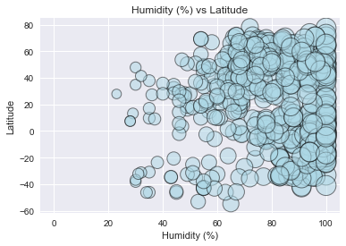

```python
import os
import csv
import json
import requests
import matplotlib.pyplot as plt
import numpy as np
import pandas as pd
import seaborn as sns

from citipy import citipy
from random import uniform


```


```python
#open weather api
url = "http://api.openweathermap.org/data/2.5/weather?"
units = "imperial"
weather_api_key = "25bc90a1196e6f153eece0bc0b0fc9eb"

#partial query URL
query_url = url + "appid=" + weather_api_key + "&units=" + units + "&q="
```


```python
#randomly generate latitude and longitude pairs
def newpoint():
   return uniform(-90,90), uniform(-180, 180)
```


```python
cities_df = pd.DataFrame(columns={"city","url","temperature","latitude","longitude",
                                  "humidity","cloudiness","wind_speed"},index=np.arange(500))

cities = []
index = 0

#generate random coordinates
points = (newpoint() for x in range(5000))

#loop thru the points
for point in points:

    #find nearest city by coordinates
    city = citipy.nearest_city(point[0],point[1])
    
    #make sure that city is not already in the cities list
    if not city.city_name in cities:
       
        #get weather info
        city_url = query_url + city.city_name
        response = requests.get(city_url).json()

        if 'main' not in response:
            print(f'weather in city {city.city_name} not found')
        else:
            #save selected cities
            cities.append(city.city_name)

            #update row values
            cities_df.loc(index)[index]["city"] = city.city_name
            cities_df.loc(index)[index]["url"] = city_url
            cities_df.loc(index)[index]["temperature"] = response["main"]["temp"]
            cities_df.loc(index)[index]["latitude"] = response["coord"]["lat"]
            cities_df.loc(index)[index]["longitude"] = response["coord"]["lon"]
            cities_df.loc(index)[index]["humidity"] = response["main"]["humidity"]
            cities_df.loc(index)[index]["cloudiness"] = response["clouds"]["all"]
            cities_df.loc(index)[index]["wind_speed"] = response["wind"]["speed"]
            
            #increment the index
            index = index + 1
            if index == 500:
                break


```

    weather in city bengkulu not found
    weather in city katsiveli not found
    weather in city satitoa not found
    weather in city illoqqortoormiut not found
    weather in city chagda not found
    weather in city belushya guba not found
    weather in city mys shmidta not found
    weather in city kamenskoye not found
    weather in city illoqqortoormiut not found
    weather in city karaul not found
    weather in city samusu not found
    weather in city tome-acu not found
    weather in city mananara not found
    weather in city karmana not found
    weather in city attawapiskat not found
    weather in city barentsburg not found
    weather in city malwan not found
    weather in city vaitupu not found
    weather in city barentsburg not found
    weather in city tsihombe not found
    weather in city belushya guba not found
    weather in city grand river south east not found
    weather in city sentyabrskiy not found
    weather in city louisbourg not found
    weather in city illoqqortoormiut not found
    weather in city barentsburg not found
    weather in city attawapiskat not found
    weather in city hurghada not found
    weather in city alappuzha not found
    weather in city guelengdeng not found
    weather in city mys shmidta not found
    weather in city malwan not found
    weather in city barentsburg not found
    weather in city sentyabrskiy not found
    weather in city illoqqortoormiut not found
    weather in city sentyabrskiy not found
    weather in city urumqi not found
    weather in city tumannyy not found
    weather in city tsihombe not found
    weather in city fevralsk not found
    weather in city amderma not found
    weather in city azimur not found
    weather in city mys shmidta not found
    weather in city sentyabrskiy not found
    weather in city illoqqortoormiut not found
    weather in city illoqqortoormiut not found
    weather in city sentyabrskiy not found
    weather in city barentsburg not found
    weather in city umzimvubu not found
    weather in city taolanaro not found
    weather in city vaitupu not found
    weather in city attawapiskat not found
    weather in city attawapiskat not found
    weather in city sentyabrskiy not found
    weather in city nizhneyansk not found
    weather in city bengkulu not found
    weather in city labutta not found
    weather in city belushya guba not found
    weather in city sentyabrskiy not found
    weather in city taolanaro not found
    weather in city saleaula not found
    weather in city nizhneyansk not found
    weather in city illoqqortoormiut not found
    weather in city korla not found
    weather in city sentyabrskiy not found
    weather in city tsihombe not found
    weather in city palabuhanratu not found
    weather in city maarianhamina not found
    weather in city nguiu not found
    weather in city ngukurr not found
    weather in city bengkulu not found
    weather in city illoqqortoormiut not found
    weather in city asau not found
    weather in city vaitupu not found
    weather in city dien bien not found
    weather in city taolanaro not found
    weather in city barentsburg not found
    weather in city rolim de moura not found
    weather in city tambul not found
    weather in city taolanaro not found
    weather in city asau not found
    weather in city nizhneyansk not found
    weather in city barentsburg not found
    weather in city tiglawigan not found
    weather in city samusu not found
    weather in city yanan not found
    weather in city halalo not found
    weather in city mys shmidta not found
    weather in city labutta not found
    weather in city siddharthanagar not found
    weather in city palabuhanratu not found
    weather in city ozgon not found
    weather in city belushya guba not found
    weather in city asau not found
    weather in city asau not found
    weather in city rungata not found
    weather in city taolanaro not found
    weather in city sakakah not found
    weather in city grand river south east not found
    weather in city illoqqortoormiut not found
    weather in city kismayo not found
    weather in city samalaeulu not found
    weather in city taolanaro not found
    weather in city raga not found
    weather in city aban not found
    weather in city taburi not found
    weather in city lolua not found
    weather in city kuche not found
    weather in city taolanaro not found
    weather in city akyab not found
    weather in city illoqqortoormiut not found
    weather in city amderma not found
    weather in city attawapiskat not found
    weather in city mys shmidta not found
    weather in city belushya guba not found
    weather in city mahadday weyne not found
    weather in city saleaula not found
    weather in city palabuhanratu not found
    weather in city taolanaro not found
    weather in city bengkulu not found
    weather in city aban not found
    weather in city samusu not found
    weather in city vaitupu not found
    weather in city belushya guba not found
    weather in city koungou not found
    weather in city buqayq not found
    weather in city barentsburg not found
    weather in city karkaralinsk not found
    weather in city barentsburg not found
    weather in city nizhneyansk not found
    weather in city barentsburg not found
    weather in city belushya guba not found
    weather in city taolanaro not found
    weather in city illoqqortoormiut not found
    weather in city amderma not found
    weather in city cagayan de tawi-tawi not found
    weather in city tsihombe not found
    weather in city barentsburg not found
    weather in city warqla not found
    weather in city taolanaro not found
    weather in city chagda not found
    weather in city palaiokhora not found
    weather in city solsvik not found
    weather in city taolanaro not found
    


```python
cities_df['city'] = cities_df['city'].astype(str)
cities_df['url'] = cities_df['url'].astype(str)
cities_df['temperature'] = cities_df['temperature'].astype(float)
cities_df['humidity'] = cities_df['humidity'].astype(float)
cities_df['latitude'] = cities_df['latitude'].astype(float)
cities_df['longitude'] = cities_df['longitude'].astype(float)
cities_df['cloudiness'] = cities_df['cloudiness'].astype(float)
cities_df['wind_speed'] = cities_df['wind_speed'].astype(float)


cities_df.head()

```


<div>
<style>
    .dataframe thead tr:only-child th {
        text-align: right;
    }

    .dataframe thead th {
        text-align: left;
    }

    .dataframe tbody tr th {
        vertical-align: top;
    }
</style>
<table border="1" class="dataframe">
  <thead>
    <tr style="text-align: right;">
      <th></th>
      <th>temperature</th>
      <th>humidity</th>
      <th>url</th>
      <th>latitude</th>
      <th>cloudiness</th>
      <th>city</th>
      <th>longitude</th>
      <th>wind_speed</th>
    </tr>
  </thead>
  <tbody>
    <tr>
      <th>0</th>
      <td>78.80</td>
      <td>78.0</td>
      <td>http://api.openweathermap.org/data/2.5/weather...</td>
      <td>-6.97</td>
      <td>40.0</td>
      <td>cabedelo</td>
      <td>-34.84</td>
      <td>5.82</td>
    </tr>
    <tr>
      <th>1</th>
      <td>48.38</td>
      <td>99.0</td>
      <td>http://api.openweathermap.org/data/2.5/weather...</td>
      <td>32.92</td>
      <td>92.0</td>
      <td>talagang</td>
      <td>72.41</td>
      <td>4.21</td>
    </tr>
    <tr>
      <th>2</th>
      <td>37.40</td>
      <td>59.0</td>
      <td>http://api.openweathermap.org/data/2.5/weather...</td>
      <td>33.93</td>
      <td>40.0</td>
      <td>katsuura</td>
      <td>134.50</td>
      <td>14.99</td>
    </tr>
    <tr>
      <th>3</th>
      <td>53.51</td>
      <td>75.0</td>
      <td>http://api.openweathermap.org/data/2.5/weather...</td>
      <td>8.40</td>
      <td>8.0</td>
      <td>tchollire</td>
      <td>14.17</td>
      <td>2.75</td>
    </tr>
    <tr>
      <th>4</th>
      <td>80.06</td>
      <td>99.0</td>
      <td>http://api.openweathermap.org/data/2.5/weather...</td>
      <td>-23.12</td>
      <td>80.0</td>
      <td>rikitea</td>
      <td>-134.97</td>
      <td>16.62</td>
    </tr>
  </tbody>
</table>
</div>


```python
sns.set()
```


```python
#distribution of selected coordinates
#the original list is more uniformedly random
#this list is not due the exclusion of unavailable weather data 
plt.scatter(cities_df['latitude'], cities_df['longitude'])
plt.show()
```


```python
plt.scatter(cities_df["temperature"], cities_df["latitude"], marker="o", alpha=0.5,  
            edgecolor="black", linewidths=1, color="lightpink", s=cities_df["temperature"]*5)
plt.title("Temperature (°F) vs Latitude")
plt.xlabel("Temperature (°F)")
plt.ylabel("Latitude")
plt.grid(True)

# Save the figure
plt.savefig("TemperatureLatitudeInSelectCities.png")

# Show plot
plt.show()
```

    C:\Users\ng_th\Documents\software\Anaconda\lib\site-packages\matplotlib\collections.py:836: RuntimeWarning: invalid value encountered in sqrt
      scale = np.sqrt(self._sizes) * dpi / 72.0 * self._factor
    


```python
plt.scatter(cities_df["humidity"], cities_df["latitude"], marker="o", alpha=0.5,
            edgecolor="black", linewidths=1, color="lightblue", s=cities_df["humidity"]*5)
plt.title("Humidity (%) vs Latitude")
plt.xlabel("Humidity (%)")
plt.ylabel("Latitude")
plt.grid(True)

# Save the figure
plt.savefig("HumidityLatitudeInSelectCities.png")

# Show plot
plt.show()
```





```python
plt.scatter(cities_df["cloudiness"], cities_df["latitude"], marker="o", alpha=0.5, 
            edgecolor="black", linewidths=1, color="lightgreen", s=cities_df["cloudiness"]*5)
plt.title("Cloudiness (%) vs Latitude")
plt.xlabel("Cloudiness (%)")
plt.ylabel("Latitude")
plt.grid(True)

# Save the figure
plt.savefig("CloudinessLatitudeInSelectCities.png")

# Show plot
plt.show()
```


```python
plt.scatter(cities_df["wind_speed"], cities_df["latitude"], marker="o", alpha=0.5, 
            edgecolor="black", linewidths=1, color="mediumpurple", s=cities_df["wind_speed"]*5)
plt.title("Wind Speed (mph) vs Latitude")
plt.xlabel("Wind Speed (mph)")
plt.ylabel("Latitude")
plt.grid(True)

# Save the figure
plt.savefig("WindSpeedLatitudeInSelectCities.png")

# Show plot
plt.show()
```


```python
#write to csv file    
with open('CityList.csv', 'w', newline="") as csvFile:
    csvWriter = csv.writer(csvFile, delimiter=',')
    #headers
    csvWriter.writerow(["","City Name","Weather URL"])
    #zipped lists
    csvWriter.writerows(zip(cities_df.index, cities_df["city"], cities_df["url"]))
```

Observed trends (based on the selection of world cities)

1. The northern hemisphere is cooler than the equator and the southern hemisphere.
2. The northern hemisphere is more humid than the southern hemisphere. 
3. The cloudiness is even distributed across latitudes.


