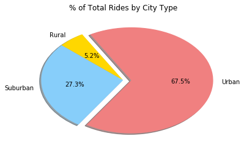
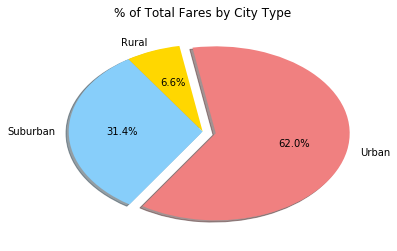
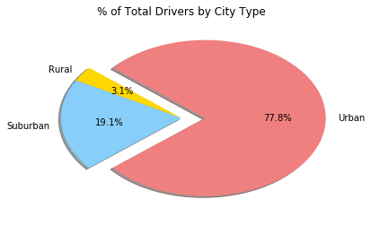

```python
# Dependencies
import matplotlib.pyplot as plt
import numpy as np
import pandas as pd
import os
import seaborn as sns


#city data
city_file_name = os.path.join("resources", "city_data.csv")
city_file = pd.read_csv(city_file_name)
city_df = pd.DataFrame(city_file)
#create new columns City, Driver Count, Type  
city_df[['city','driver_count','type']] = city_df['city,driver_count,type'].str.split(',', expand=True)
city_df = city_df.drop('city,driver_count,type', axis=1)
city_df['driver_count'].fillna(0)
city_df['driver_count'] = city_df['driver_count'].astype(int)

#ride data
ride_file_name = os.path.join("resources", "ride_data.csv")
ride_file = pd.read_csv(ride_file_name)
ride_df = pd.DataFrame(ride_file)
#create new columns City, Driver Count, Type  
ride_df[['city','date','fare','ride_id']] = ride_df['city,date,fare,ride_id'].str.split(',', expand=True)
ride_df = ride_df.drop('city,date,fare,ride_id', axis=1)
#format date
ride_df['date'] =  pd.to_datetime(ride_df['date'])
#replace all NaN with zero
ride_df['fare'].fillna(0)

#compute total fares 
ride_df['fare'] = ride_df['fare'].astype(float)
total_fares = ride_df.groupby('city')['fare'].sum()
total_fares = total_fares.reset_index()
total_fares['fare'] = total_fares['fare'].fillna(0)

#compute ride count
ride_count = ride_df.groupby('city')['ride_id'].count()
ride_count = ride_count.reset_index()
ride_count['ride_id'] = ride_count['ride_id'].fillna(0)

#the result of inner and outer joins are the same
first_pair_df = pd.merge(city_df,total_fares,how='outer',on='city')  
combined_df = pd.merge(first_pair_df,ride_count,how='outer',on='city')  

combined_df.rename(columns={'ride_id': 'ride_count'},inplace=True)
combined_df['average_fare'] = combined_df['fare'] / combined_df['ride_count'] 
combined_df.head()
```


<div>
<style>
    .dataframe thead tr:only-child th {
        text-align: right;
    }

    .dataframe thead th {
        text-align: left;
    }

    .dataframe tbody tr th {
        vertical-align: top;
    }
</style>
<table border="1" class="dataframe">
  <thead>
    <tr style="text-align: right;">
      <th></th>
      <th>city</th>
      <th>driver_count</th>
      <th>type</th>
      <th>fare</th>
      <th>ride_count</th>
      <th>average_fare</th>
    </tr>
  </thead>
  <tbody>
    <tr>
      <th>0</th>
      <td>Kelseyland</td>
      <td>63</td>
      <td>Urban</td>
      <td>610.58</td>
      <td>28</td>
      <td>21.806429</td>
    </tr>
    <tr>
      <th>1</th>
      <td>Nguyenbury</td>
      <td>8</td>
      <td>Urban</td>
      <td>673.39</td>
      <td>26</td>
      <td>25.899615</td>
    </tr>
    <tr>
      <th>2</th>
      <td>East Douglas</td>
      <td>12</td>
      <td>Urban</td>
      <td>575.72</td>
      <td>22</td>
      <td>26.169091</td>
    </tr>
    <tr>
      <th>3</th>
      <td>West Dawnfurt</td>
      <td>34</td>
      <td>Urban</td>
      <td>647.58</td>
      <td>29</td>
      <td>22.330345</td>
    </tr>
    <tr>
      <th>4</th>
      <td>Rodriguezburgh</td>
      <td>52</td>
      <td>Urban</td>
      <td>490.65</td>
      <td>23</td>
      <td>21.332609</td>
    </tr>
  </tbody>
</table>
</div>


```python
urban_summary = pd.DataFrame(columns=['average_fare','ride_count'])
subur_summary = urban_summary.copy()
rural_summary = urban_summary.copy()

for i, row in combined_df.iterrows():
    ride_count = 0
    average_fare = 0
    if row['ride_count'] > 0:
        average_fare = '{:.2f}'.format(row['average_fare'])      
        ride_count = '{:.0f}'.format(row['ride_count'])
    
    each = [average_fare, ride_count]

    row_type = row['type']
    if row_type == "Urban":
        urban_summary.loc[row['city']] = each
    elif row_type == "Suburban":
        subur_summary.loc[row['city']] = each
    else:
        rural_summary.loc[row['city']] = each

urban_summary = urban_summary.fillna(0)
urban_summary['average_fare'] = urban_summary['average_fare'].astype(float)
urban_summary['ride_count'] = urban_summary['ride_count'].astype(int)

subur_summary = subur_summary.fillna(0)
subur_summary['average_fare'] = subur_summary['average_fare'].astype(float)
subur_summary['ride_count'] = subur_summary['ride_count'].astype(int)

rural_summary = rural_summary.fillna(0)
rural_summary['average_fare'] = rural_summary['average_fare'].astype(float)
rural_summary['ride_count'] = rural_summary['ride_count'].astype(int)

```


```python
sns.set()
urban = plt.scatter(urban_summary['ride_count'], urban_summary['average_fare'], edgecolor='black',
                    marker="o", color="lightcoral", label='Urban', alpha=0.5,
                    s=urban_summary['ride_count']*10)
subur = plt.scatter(subur_summary['ride_count'], subur_summary['average_fare'], edgecolor='black',
                    marker="o", color="lightskyblue", label='Suburban', alpha=0.5,
                    s=subur_summary['ride_count']*10)
rural = plt.scatter(rural_summary['ride_count'], rural_summary['average_fare'], edgecolor='black',
                    marker="o", color="gold", label='Rural', alpha=0.5,
                    s=rural_summary['ride_count']*10)

plt.grid(True)

plt.title("Pyber Ride Sharing Data (2016)")
plt.xlabel("Total Number of Rides (Per city)")
plt.ylabel("Average Fares ($)")

x_max = urban_summary['ride_count'].max() or subur_summary['ride_count'].max() or rural_summary['ride_count'].max()
plt.xlim(0, x_max + 5)
y_min = urban_summary['average_fare'].min() or subur_summary['average_fare'].min() or rural_summary['average_fare'].min()
y_max = urban_summary['average_fare'].max() or subur_summary['average_fare'].max() or rural_summary['average_fare'].max()
plt.ylim(y_min - 5, y_max + 15)

legend = plt.legend(handles=[urban, subur, rural],loc="best", scatterpoints=1)
for handle in legend.legendHandles:
    handle.set_sizes([30.0])
    
plt.show()


```


```python
#colors of each section of the pie chart
colors = ["gold", "lightskyblue", "lightcoral"]
#equal axis
plt.axis("equal")

```


    (-0.055000000000000007,
     0.055000000000000007,
     -0.055000000000000007,
     0.055000000000000007)


```python
explode = (0, 0, 0.1)
ride_count = pd.DataFrame(combined_df.groupby('type')['ride_count'].sum())
plt.pie(ride_count, autopct='%1.1f%%', explode=explode, labels=ride_count.index,
        colors=colors, shadow=True, startangle=120)
plt.title("% of Total Rides by City Type", fontsize=12, fontweight="normal")
plt.figure(figsize=(8,8))
plt.show()
```





    <matplotlib.figure.Figure at 0x1cf6b92a9e8>


```python
explode = (0, 0, 0.1)
fare_sum = pd.DataFrame(combined_df.groupby('type')['fare'].sum())
plt.pie(fare_sum, autopct='%1.1f%%', explode=explode, labels=fare_sum.index,
        colors=colors, shadow=True, startangle=100)
plt.title("% of Total Fares by City Type", fontsize=12, fontweight="normal")
plt.figure(figsize=(8,8))
plt.show()
```





    <matplotlib.figure.Figure at 0x1cf6b956128>


```python
explode = (0, 0, 0.2)
extract_data = combined_df.groupby(['type','city','driver_count']).sum()
extract_data = extract_data.reset_index()
driver_count = pd.DataFrame(extract_data.groupby('type')['driver_count'].sum())

plt.pie(driver_count, autopct='%1.1f%%', explode=explode, labels=driver_count.index,
        colors=colors, shadow=True, startangle=140)
plt.title("% of Total Drivers by City Type", fontsize=12, fontweight="normal")
plt.figure(figsize=(8,8))
plt.show()
```





    <matplotlib.figure.Figure at 0x1cf6b956898>


Observed trends:

1. Urban cities account for the largest parts of their shares in total rides, total fares, and total drivers. Rural cities have smaller shares in those categories compared to the suburban cities.

2. As the number of rides increases, the average fare stays flat or exhibits a small change for urban and suburban cities. On the contrary, an increase in the number of rides in rural cities may cause the average fare to go up. However, the change is not proportional.

3. The average fare in rural cities spreads wider than suburban and urban cities. It can be as less expensive as it is in urban cities. However, it can be the most expensive of all city types.
