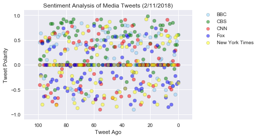
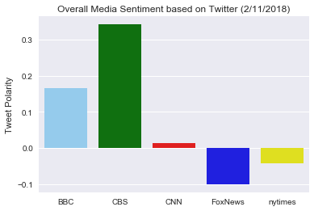

```python
import numpy as np
import pandas as pd
import matplotlib.pyplot as plt
import requests as req
import seaborn as sns
import os
import json
import tweepy
import calendar
import pytz
import time

from datetime import datetime, date, timedelta
from dateutil import parser, zoneinfo
zone = zoneinfo.gettz('UTC')

from vaderSentiment.vaderSentiment import SentimentIntensityAnalyzer
analyzer = SentimentIntensityAnalyzer()

```


```python
api_dir = os.path.dirname(os.path.dirname(os.path.realpath('keys')))
file_name = os.path.join(api_dir + "//keys", "api_keys_mai.json")
data = json.load(open(file_name))

gkey = data['google_api_key']
consumer_key = data['twitter_consumer_key']
consumer_secret = data['twitter_consumer_secret']
access_token = data['twitter_access_token']
access_token_secret = data['twitter_access_token_secret']
```


```python
auth = tweepy.OAuthHandler(consumer_key, consumer_secret)
auth.set_access_token(access_token, access_token_secret)
api = tweepy.API(auth, parser=tweepy.parsers.JSONParser())

```


```python
sentiment_df = pd.DataFrame(columns=["tweet_time","user",
                                     "compound","tweet_ago"],
                            index=np.arange(500))

target_users = ["BBC", "CBS", "CNN", "FoxNews", "nytimes"]

count = 0
tweet_count = 0

#one user at a time
for user in target_users:

    # Get all tweets from user timeline
    # Request more than 100 tweets as tweepy may return 99 for the request of 100
    tweets = api.user_timeline(screen_name=user,count=105,result_type='recent')       

    # Reset the tweet count
    tweet_count = 0
    # Loop through all tweets
    for tweet in tweets:
        
        sentiment_df.set_value(count, "tweet_time", tweet["created_at"])
        sentiment_df.set_value(count, "user", user)
        sentiment_df.set_value(count, "tweet_ago", 0)
        
        compound = analyzer.polarity_scores(tweet["text"])["compound"]
        sentiment_df.set_value(count, "compound", compound)

        # Add to Counter
        count = count + 1
        tweet_count = tweet_count + 1
        
        #only use 100 tweets
        if tweet_count + 1 > 100:
            break
        

```


```python
sentiment_df = sentiment_df.sort_values(["user","tweet_time"],ascending=True)

user = ""
start = 0
for i,row in sentiment_df.iterrows():
    if row["user"] == user:
        start = start + 1    
    else:
        user = row["user"]
        start = 0

    sentiment_df.set_value(i,"tweet_ago",start)
        
sentiment_df["tweet_time"] = pd.to_datetime(sentiment_df["tweet_time"])
sentiment_df["compound"] = sentiment_df["compound"].astype(float)
sentiment_df["tweet_ago"] = sentiment_df["tweet_ago"].astype(int)

sentiment_df = sentiment_df.sort_values("tweet_ago",ascending=True)

```


```python


```


```python
sns.set()

user_colors = ["lightskyblue", "green", "red", "blue", "yellow"]

#build chart for each user
bbc_df = sentiment_df[(sentiment_df["user"] == "BBC")]
bbc = plt.scatter(bbc_df['tweet_ago'],bbc_df['compound'],edgecolor='black',
                  marker="o",color=user_colors[0],label='BBC',alpha=0.5)

cbs_df = sentiment_df[(sentiment_df["user"] == "CBS")]
cbs = plt.scatter(cbs_df['tweet_ago'],cbs_df['compound'],edgecolor='black',
                  marker="o",color=user_colors[1],label='CBS',alpha=0.5)

cnn_df = sentiment_df[(sentiment_df["user"] == "CNN")]
cnn = plt.scatter(cnn_df['tweet_ago'],cnn_df['compound'],edgecolor='black',
                  marker="o",color=user_colors[2],label='CNN',alpha=0.5)

fox_df = sentiment_df[(sentiment_df["user"] == "FoxNews")]
fox = plt.scatter(fox_df['tweet_ago'],fox_df['compound'],edgecolor='black',
                  marker="o",color=user_colors[3],label='Fox',alpha=0.5)

nyt_df = sentiment_df[(sentiment_df["user"] == "nytimes")]
nyt = plt.scatter(nyt_df['tweet_ago'],nyt_df['compound'],edgecolor='black',
                  marker="o",color=user_colors[4],label='New York Times',alpha=0.5)


#format the chart
plt.grid(True)

plt.title("Sentiment Analysis of Media Tweets (2/11/2018)")
plt.xlabel("Tweet Ago")
plt.ylabel("Tweet Polarity")

plt.xlim(110,-10)
plt.ylim(-1.1,1.1)

plt.yticks(np.arange(-1,1.1,0.5))

legend = plt.legend(handles=[bbc,cbs,cnn,fox,nyt],
                    bbox_to_anchor=(1.05,1),
                    loc=2,borderaxespad=0.)

for handle in legend.legendHandles:
    handle.set_sizes([40.0])
    
plt.show()

plt.savefig("resources/sentiment_analysis_tweets.png")
```





```python
#calculate the average sentiment
group_df = sentiment_df.groupby(["user"]).mean()
group_df = group_df.reset_index()

colors = {"BBC": "lightskyblue", "CBS": "green", "CNN": "red", 
          "FoxNews": "blue", "nytimes": "yellow"}

#draw bar chart 
sns.barplot(x=group_df["user"],y=group_df["compound"],palette=colors)
plt.title("Overall Media Sentiment based on Twitter (2/11/2018)")
plt.xlabel("")
plt.ylabel("Tweet Polarity")

plt.show()
plt.savefig("resources/overall_media_sentiment.png")
```





Observable trends:
1. BBC and CBS tweets are more positive.
2. CNN tweets are equally positive and negative. CNN tweet average sentiment is close to positively neutral.
3. The New York Times and FoxNews tweets are more negative.

